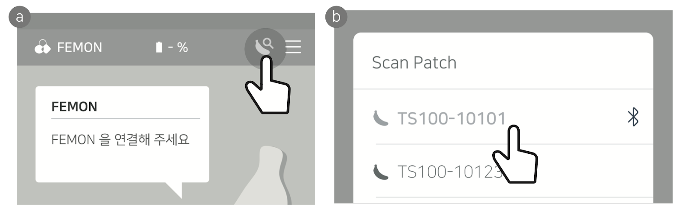

# 1.1. FEMON 애플리케이션

이 장에서는 FEMON 애플리케이션을 사용하여 통신하는 방법을 설명한다.

## FEMON 애플리케이션 사용 방법

바나나 체온계를 FEMON 애플리케이션과 함께 사용하는 방법은 다음과 같다.

1. 패치 전원 켜기

* 전원 버튼을 2초 정도 눌러 전원을 켠다.

2. 애플리케이션 다운로드

* 아래 링크를 통해 FEMON 애플리케이션을 설치한다.
  * Android 설치 주소: [https://play.google.com/store/apps/details?id=com.lstgrp.prodsic](https://play.google.com/store/apps/details?id=com.lstgrp.prodsic)

> **주의** 이 애플리케이션은 이전 버전의 Android를 위해 만들어졌기 때문에 현재 기기에서 사용할 수 없다는 오류가 발생할 수 있다. 이 경우 아래 링크를 통해 애플리케이션을 직접 다운로드하여 설치한다. \
[https://drive.google.com/file/d/1m873CyZUNqNhcpVIGJrOSMrzVOk-Himt/view?usp=drive\_link](https://drive.google.com/file/d/1m873CyZUNqNhcpVIGJrOSMrzVOk-Himt/view?usp=drive\_link)

3. 애플리케이션 실행 및 패치 연결

* 애플리케이션을 실행한 후, 메인 화면에서  아이콘 또는  아이콘을 터치한다.
* 블루투스 사용에 동의한 후, 패치 리스트 팝업창에서 연결 가능한 패치를 검색하여 선택한다.

<figure style="text-align: center;">
  
  <figcaption style="text-align: center;">FEMON 블루투스 연결</figcaption>
</figure>

4. 패치가 검색되지 않을 경우

* 패치의 블루투스 체크 스위치 버튼을 한 번 누른 뒤, 위 과정을 다시 시도한다.

<figure style="text-align: center;">
  
  <figcaption style="text-align: center;">바나나 체온계 블루투스 체크 스위치 클릭</figcaption>
</figure>

5. 블루투스 페어링

* 검색된 패치를 선택하면 블루투스 페어링 요청 확인 화면이 나타난다. 
* 핀코드 입력란에 PIN Code 스티커에 기재된 숫자 6자리를 입력한다.

<figure style="text-align: center;">
  
  <figcaption style="text-align: center;">블루투스 페어링 PIN Code 입력</figcaption>
</figure>

6. 패치 부착

* 체온 측정을 위한 온도 센서가 피부(겨드랑이 부위)에 완전히 밀착되도록 패치를 피부에 잘 부착한다.

7. 체온 표시

* 패치 연결 및 부착이 완료되면, 메인 화면 중앙에 측정 대상자의 체온이 표시된다.
* 센서가 정확한 온도를 감지하는 데 약 3~4분 정도 소요된다.

8. 패치 연결 / 해제

*  아이콘은 패치와 애플리케이션의 연결 상태를,  아이콘은 패치와 애플리케이션의 연결 해제 상태를 나타낸다.
* 이 버튼을 통해 빠르게 재연결 및 연결 해제가 가능하다.
* 단, 애플리케이션과 패치의 연결 이력이 최소 1회 이상 있어야 한다.
* 재연결이 되지 않을 경우:
  1.  버튼을 누른다.
  2. 패치의 블루투스 버튼을 짧게 한 번 누른다. 
* 다른 패치를 연결하고자 할 때에는, 우측 상단의  버튼을 누른다.

9. 알림 설정 기능

* 메인 화면 중앙의  버튼을 통해 알림 ON/OFF를 설정할 수 있다.
* 알림 온도는 상단 우측 메뉴의 'Alert'에서 설정 가능하다.
* 설정 가능한 온도 범위는 34°C ~ 41°C 이다.
* 체온계의 온도가 설정된 온도를 벗어날 경우:
  - 알림이 울린다.
  - 체온 측정 속도가 빨라진다.
* 알림 형태: 
  - 진동
  - 소리
  - 알림창 Push
  - 패치의 적색 LED 점멸 (안정 온도일 때는 녹색 LED 점멸)

10. 체온 리뷰

* 메인 화면 중앙의  버튼을 누르면, 시간에 따른 체온 변화를 확인할 수 있다.
* 그래프 설명:
  - 노란색 실선, 점: 패치로부터 받은 데이터
  - 파란색 점: 사용자가 직접 입력한 데이터
  - 빨간색 실선: 고온 알림 설정한 온도 가이드 선
  - 청록색 점선: 저온 알림 설정한 온도 가이드 선
* 리뷰 페이지 상단의  버튼을 누르면, 사용자가 직접 시간과 체온을 지정하여 입력할 수 있다.

<figure style="text-align: center;">
  
  <figcaption style="text-align: center;">체온 리뷰</figcaption>
</figure>

11. 집중 모니터링

* 체온 디스플레이를 누르면, 20초 동안 1초에 1회씩 온도를 측정하여 대상자의 체온을 집중적으로 모니터링할 수 있다.
* (기본 설정은 5초에 1회 온도 측정)

<figure style="text-align: center;">
  
  <figcaption style="text-align: center;">집중 모니터링</figcaption>
</figure>

12. 고온 이력 조회

* 메인 화면 하단의 좌우 스크롤 바를 통해 최근 72시간 동안의 고온(37.0°C 이상) 이력을 확인할 수 있다.
* 온도 표시 색상:
  - 노란색: 37.0°C ~ 37.4°C
  - 주황색: 37.5°C ~ 37.9°C
  - 빨간색: 38.0°C 이상
* 색상 구간을 누르면 가장 높았던 기록의 온도가 말풍선으로 표시된다.
* 데이터 표시:
  - : 패치로부터 받은 데이터
  - : 사용자가 직접 입력한 데이터
* 자세한 온도 데이터는  버튼을 통해 확인할 수 있다.
* 주의: 패치와 연결되지 않은 시간과 저온 알림은 표시되지 않는다.

13. 패치 절전모드

* 절전모드 설정:
  1. 패치의 블루투스 버튼을 3초 정도 누른다.
  2. 적색과 녹색 LED가 동시에 켜진다.
  3. 녹색 LED가 깜빡이다가 꺼지면 절전모드가 된다.
* 절전모드 해제:
  - 패치의 블루투스 버튼을 짧게 한 번 누른다.
  - 재동작 시 LED가 녹색 혹은 적색으로 점멸한다.

* 전원 끄기:
  1. 패치의 블루투스 버튼을 6초 정도 누른 상태를 유지한다.
  2. LED가 소등 - 점멸 - 소등 순서로 변화하며 전원이 종료된다.
  * 주의: 
    - 전원을 끄면 저장된 데이터는 복구되지 않는다.
    - 패치의 배터리가 완전히 소모되면 자동으로 전원이 꺼진다. 이 경우에도 데이터는 복구되지 않는다.
    - 패치의 전원을 끌 때는 반드시 측정 대상자로부터 패치를 떼어낸 후 작동해야 한다.

14. 메뉴

* 메인 화면 우측 상단  버튼을 통해 다양한 설정 및 정보를 확인할 수 있다.
* 메뉴 항목:
  - 알림: 저온과 고온 알림의 온도를 설정할 수 있다.
  - 설정: 
    * 섭씨/화씨 단위 선택
    * 위험 온도와 안정 온도일 때의 측정 주기 설정 (측정 주기가 길수록 배터리 수명이 늘어난다)
  - 도움말: 애플리케이션의 사용법을 확인할 수 있다.
  - 약관 및 정책: 애플리케이션의 이용약관과 개인정보처리방침을 확인할 수 있다.
  - 회사정보: 회사명, 제품 소개 홈페이지, 지원되는 E-mail, 카카오톡, 전화번호를 확인할 수 있다.
